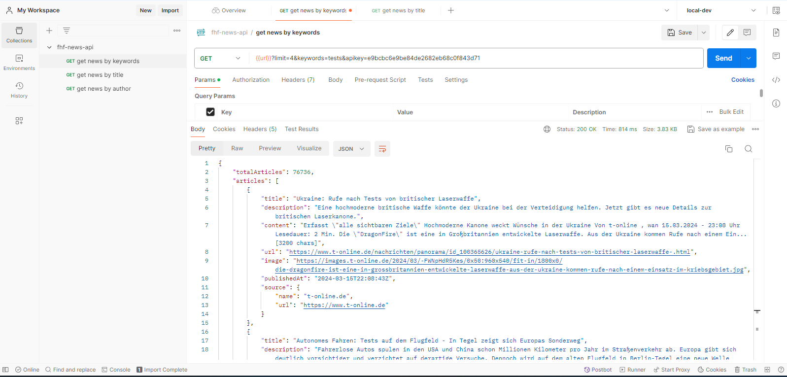
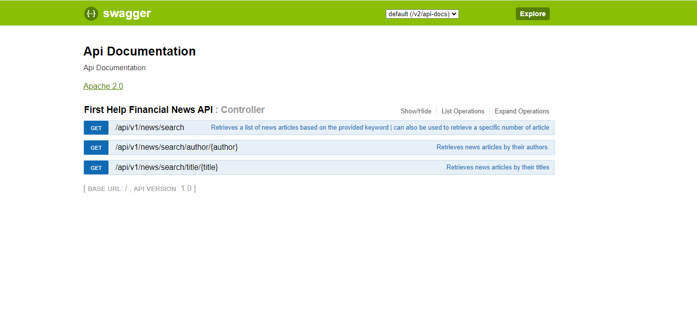

# First Help Financial News API

This is a simple REST API framework built with Java and the Spring framework. It interacts with a public news API in this case GNews API to fetch news articles. 
The API provides endpoints to fetch N news articles, find articles by title or author, and search by keywords. 
Additionally, caching is implemented to enhance performance by storing previously fetched articles.


## Approach

This project follows the hexagonal architecture pattern, also known as ports and adapters architecture. 
In this architecture, the application core is decoupled from external dependencies such as databases, APIs, or UIs, allowing for better testability, maintainability, and flexibility. 

In our implementation, we have structured the project into three distinct modules:

* Core: This module serves as the repository for our API's business logic. It encapsulates the fundamental functionality and rules governing our system's behavior.

* API: This module houses the implementation of our API endpoints. The API layer can be generated based on open-api schemas and acts as the interface through which external systems interact with our application.

* Application: The Application module contains all configuration settings and serves as the entry point for our system. 

By organizing our project in this manner, we achieve a clear separation of concerns, making it easier to manage and evolve individual components independently. Additionally, this architectural approach promotes scalability and adaptability, allowing us to accommodate future changes and enhancements with minimal disruption.


## Getting Started

### Prerequisites

- Java Development Kit (JDK) version 8 or higher
- Docker (optional, for running the application as a container)
- Gradle (used for dependency management) - This project utilizes the Gradle wrapper for managing dependencies.

### Installation (Clone and build)

1. Clone this repository to your local machine:

   ```bash
   git clone https://github.com/Beauclair/fhf-news-api.git

2. Navigate to the project directory:

   ```bash
   cd fhf-news-api

3. Build the project using Gradle wrapper::

   ```bash
   ./gradlew clean build

### Running 

1. Run as standalone application 

   ```bash
   ./gradlew bootRun

2. Run as container

   ```bash
   docker build -t fhf-news-api:1.0 .
   docker run -d -p 8080:8080 -t fhf-news-api:1.0

**Note:** Running both methods simultaneously is not recommended as they utilize the same host port. To resolve this issue easily, adjust the host port in the Docker run command to 8081 and utilize this port during testing.
Once the application is running, you can access the API endpoints using tools like curl, Postman, or your web browser.

### Testing 

#### Available API Endpoints
`GET GET /api/v1/news/search` - Retrieves a list of news articles based on the provided keyword | can also be used to retrieve a specific number of article
`GET /api/v1/news/search/author/{author}` - Retrieves news articles by their authors
`GET /api/v1/news/search/title/{title}` - Retrieves news articles by their titles

#### sample curl request/response
``
curl --location 'http://localhost:8080/api/v1/news/search?limit=4&keywords=tests&apikey=<YOUR_GNEWS_API_KEY>'
``
```json
{
    "totalArticles": 76736,
    "articles": [
        {
            "title": "Ukraine: Rufe nach Tests von britischer Laserwaffe",
            "description": "Eine hochmoderne britische Waffe könnte der Ukraine bei der Verteidigung helfen. Jetzt gibt es neue Details zur britischen Laserkanone.",
            "content": "Erfasst \"alle sichtbaren Ziele\" Hochmoderne Kanone weckt Wünsche in der Ukraine Von t-online , wan 15.03.2024 - 23:08 Uhr Lesedauer: 2 Min. Die \"DragonFire\" ist eine in Großbritannien entwickelte Laserwaffe. Aus der Ukraine kommen Rufe nach einem Ein... [3200 chars]",
            "url": "https://www.t-online.de/nachrichten/panorama/id_100365626/ukraine-rufe-nach-tests-von-britischer-laserwaffe-.html",
            "image": "https://images.t-online.de/2024/03/-FWNpHdR5Kes/0x50:960x540/fit-in/1800x0/die-dragonfire-ist-eine-in-grossbritannien-entwickelte-laserwaffe-aus-der-ukraine-kommen-rufe-nach-einem-einsatz-im-kriebsgebiet.jpg",
            "publishedAt": "2024-03-15T22:08:43Z",
            "source": {
                "name": "t-online.de",
                "url": "https://www.t-online.de"
            }
        },
        {
            "title": "Autonomes Fahren: Tests auf dem Flugfeld - In Tegel zeigt sich Europas Sonderweg",
            "description": "Fahrerlose Autos spulen in den USA und China schon Millionen Kilometer pro Jahr im Straßenverkehr ab. Europa gibt sich deutlich vorsichtiger und verzichtet auf derartige Versuche. Dennoch wird auf dem alten Flugfeld in Berlin-Tegel eine neue Welle sichtbar.",
            "content": "Fahrerlose Autos spulen in den USA und China schon Millionen Kilometer pro Jahr im Straßenverkehr ab. Europa gibt sich deutlich vorsichtiger und verzichtet auf derartige Versuche. Dennoch wird auf dem alten Flugfeld in Berlin-Tegel eine neue Welle si... [6271 chars]",
            "url": "https://www.welt.de/wirtschaft/article250486484/Autonomes-Fahren-Tests-auf-dem-Flugfeld-In-Tegel-zeigt-sich-Europas-Sonderweg.html",
            "image": "https://img.welt.de/img/wirtschaft/mobile250487306/3781353097-ci16x9-w1200/Testfahrteug-Motors-AI.jpg",
            "publishedAt": "2024-03-15T18:25:56Z",
            "source": {
                "name": "WELT",
                "url": "https://www.welt.de"
            }
        },
        {
            "title": "Spaceship-like disc detects colon cancer with sound-driven droplet vibration",
            "description": "ASCENDx is a breakthrough in cancer detection. Discover the innovative spaceship-like disc that allows quick and precise tests for cancer.",
            "content": "In a new study published in Science Advances, the scientists introduced an innovative spaceship-like disc that allows acoustic separation and concentration of exosomes and nucleotide detection, or shortly ASCENDx.\nColorectal cancer starts in the colo... [687 chars]",
            "url": "https://interestingengineering.com/science/enhancing-colon-cancer-detection-with-sound-driven-droplet-vibration",
            "image": "https://cms.interestingengineering.com/wp-content/uploads/2024/03/blue-glowing-water-is-being-spun-around-by-nothing-but-sound-waves.jpg",
            "publishedAt": "2024-03-15T17:43:47Z",
            "source": {
                "name": "Interesting Engineering",
                "url": "https://interestingengineering.com"
            }
        },
        {
            "title": "Lateral flow tests crafted using chewing gum, recycled fridge parts",
            "description": "Scientists have found a new way to tackle the plastic waste associated with the manufacturing of lateral flow tests (LFTs).",
            "content": "Scientists have found a new way to tackle the environmental impact of lateral flow tests (LFTs).\nWith over four billion LFTs produced annually, the use of plastic in their manufacturing presents a significant environmental challenge.\nA team of resear... [259 chars]",
            "url": "https://interestingengineering.com/science/lateral-flow-tests-crafted-from-chewing-gum-recycled-fridge-parts",
            "image": "https://cms.interestingengineering.com/wp-content/uploads/2024/03/Prototype_lateral_flow_cassettes_Large_rdax_1013x675_80-2.jpg",
            "publishedAt": "2024-03-15T16:52:24Z",
            "source": {
                "name": "Interesting Engineering",
                "url": "https://interestingengineering.com"
            }
        }
    ]
}
```
#### Postman test
The Postman collection is accessible at the project's root directory with the filename `fhf-news-api.postman_collection.json`. Import this collection into your Postman application.
Below is a sample request/response with postman


### Documentation
API documentation is available at `http://localhost:8080/swagger-ui.html` when the application is running. You can use Swagger UI to explore and test the API endpoints as well.


### Suggestions for Improvement
While the current implementation serves its purpose, there are several areas that can be improved:

- *Security:* Secure all the endpoints using methods such as API keys, OAuth, or JWT authentication.
- *Request Validation:* Implement more robust request validation to ensure data integrity and prevent malformed requests.
- *Exception Handling:* Enhance exception handling to provide meaningful error messages and handle unexpected scenarios gracefully.
- *Caching Strategy:* Consider using a more advanced caching library like Caffeine for improved caching performance and flexibility.
- *Integration Tests:* Incorporate integration tests to validate the interactions between different components of the system and ensure seamless functionality across various scenarios.